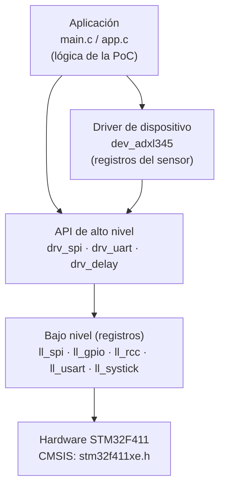
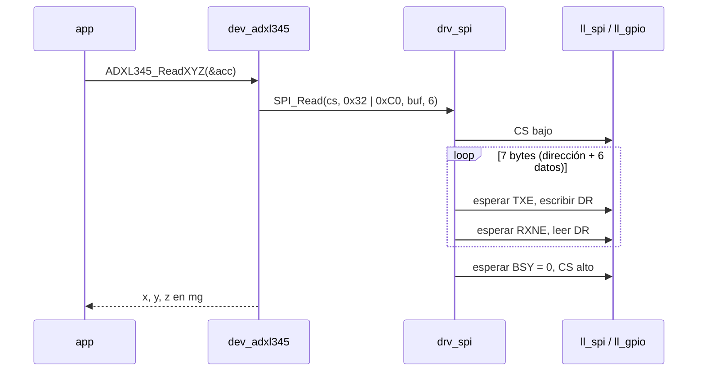

# Reto 3: Protocolos de Comunicación Serial

---
Autores: Marco Aurelio Guardia Medrano & Gildardo Estevan Restrepo Duque
Curso: Microcontroladores.
Semestre-curso: 2026-02

---
## Descripción

Driver **Bare-Metal** del periférico **SPI** de un microcontrolador STM32, escrito desde el nivel de registros sin usar librerías del fabricante (STM32Cube HAL/LL prohibidas). Sobre el driver se construye una **Capa de Abstracción de Hardware (HAL) propia**, dividida en:
- **Bajo nivel (capa física):** manipulación directa de registros (`RCC`, `GPIO`, `SPI`): habilitar relojes en APB/AHB, configurar pines en función alterna, modo de reloj (CPOL/CPHA), prescaler del baud rate, gestión de banderas `TXE`, `RXNE`, `BSY`, `OVR`, `MODF`.
- **Alto nivel (API):** funciones públicas con firmas claras (`SPI_Init`, `SPI_TransmitReceive`, `SPI_Write`, `SPI_Read`...) que aíslan a la aplicación de los registros.
**Prueba de concepto (PoC):** lectura continua de aceleración en 3 ejes desde un módulo **GY-291 (ADXL345)** por SPI (modo 3, 4 hilos), con envío de los datos a un PC por USART para visualizarlos en una terminal serial.

### Protocolo SPI (resumen)

| Característica | Valor en este proyecto |
| -------------- | ---------------------- |
| Topología | Maestro (STM32) – esclavo (ADXL345) |
| Líneas | `SCK`, `MOSI`, `MISO`, `CS` (NSS por software) |
| Modo | Modo 3 → `CPOL = 1`, `CPHA = 1` (requerido por el ADXL345) |
| Formato | 8 bits, MSB primero, full-duplex |
| Velocidad | ≤ 5 MHz (límite del ADXL345); p. ej. `f_PCLK / 4` |
| Trama ADXL345 | Bit 7 = R/W (1 = lectura), bit 6 = MB (multibyte), bits 5..0 = dirección |

---

## Estado de proyecto
>  En proceso

---

## Entornos
- STM32Cube IDE 2.2.0 (proyecto *Empty*, sin HAL/LL; solo arranque y cabeceras CMSIS de registros).
- Terminal serial (PuTTY, Tera Term o el monitor de STM32CubeIDE) a 115200 baudios.
## Herramientas
- Módulo acelerómetro de 3 ejes `GY-291` (ADXL345), comunicación SPI/I2C — aquí se usa SPI.

---

## Arquitectura del proyecto

El código se organiza en capas. Cada capa solo conoce a la inmediatamente inferior; `main.c` nunca toca registros.



| Capa | Prefijo | Qué hace | Qué **no** hace |
| ---- | ------- | -------- | --------------- |
| Aplicación | `app_`, `main` | Orquesta la PoC: inicializa, lee el sensor, imprime | Acceder a registros |
| Dispositivo | `dev_` | Conoce el mapa de registros del ADXL345 y lo expone como funciones (`ADXL345_ReadXYZ`) | Saber qué SPI o pines se usan |
| API (HAL propia) | `drv_` | Interfaz pública y portable del periférico; valida parámetros, maneja *timeouts* y errores | Escribir bits de registros directamente |
| Bajo nivel | `ll_` | Lectura/escritura de bits en registros, banderas de estado | Lógica de negocio |

### Flujo de una lectura del sensor



---

## Etapas de desarrollo

Cada etapa se trabaja en una rama `feature/*` y se integra a `develop` por Pull Request revisado por el compañero. Se busca que ambos integrantes toquen tanto el bajo nivel como la API (se evalúa el dominio de los dos).

| # | Etapa | Entregable verificable | Responsable |
| - | ----- | ---------------------- | ----------- |
| 0 | Estructura del repo y proyecto CubeIDE vacío | Compila y hace parpadear el LED (`PA5`) solo con registros | Ambos |
| 1 | `ll_rcc` + `ll_gpio` + `drv_gpio` | Pines en modo alterno AF5 para SPI1, salida para CS | Marco |
| 2 | `ll_systick` + `drv_delay` | `Delay_ms()` y base de tiempo para *timeouts* | Gildardo |
| 3 | `ll_usart` + `drv_uart` | `UART_Printf()` visible en la terminal del PC | Marco |
| 4 | `ll_spi` (registros de SPI1) | Configuración de `CR1`/`CR2`, lectura de `SR`, escritura de `DR` | Gildardo |
| 5 | `drv_spi` (API) | `SPI_TransmitReceive`, `SPI_Write`, `SPI_Read` con *timeout* y códigos de error | Ambos |
| 6 | `dev_adxl345` | Lectura de `DEVID = 0xE5`, configuración de rango y lectura XYZ | Marco |
| 7 | Aplicación PoC | Lectura continua e impresión de aceleración en g | Gildardo |
| 8 | Robustez | Manejo de `OVR`/`MODF`, reintentos, sensor desconectado sin bloqueo | Ambos |
| 9 | Documentación | Esquemático, guía de la API, capturas del analizador lógico | Ambos |

---

## Estructura del repositorio

```
09_challenge_3_library_spi_microcontrollers/
├── README.md
├── LICENSE
├── .gitignore
├── .gitattributes
├── .project / .cproject        # Proyecto de STM32CubeIDE (sí se versiona)
├── STM32F411RETX_FLASH.ld      # Linker script
├── startup/
│   └── startup_stm32f411retx.s
├── drivers/
│   └── CMSIS/                  # Solo cabeceras de registros (core_cm4.h, stm32f411xe.h)
├── inc/
│   ├── ll_rcc.h
│   ├── ll_gpio.h
│   ├── ll_systick.h
│   ├── ll_usart.h
│   ├── ll_spi.h
│   ├── drv_gpio.h
│   ├── drv_delay.h
│   ├── drv_uart.h
│   ├── drv_spi.h
│   ├── dev_adxl345.h
│   ├── app.h
│   └── board.h                 # Mapa de pines y constantes de la tarjeta
├── src/
│   ├── ll_rcc.c
│   ├── ll_gpio.c
│   ├── ll_systick.c
│   ├── ll_usart.c
│   ├── ll_spi.c
│   ├── drv_gpio.c
│   ├── drv_delay.c
│   ├── drv_uart.c
│   ├── drv_spi.c
│   ├── dev_adxl345.c
│   ├── app.c
│   ├── main.c
│   ├── syscalls.c / sysmem.c   # Generados por CubeIDE
└── docs/
    ├── esquematico/            # Diagrama de conexión de la PoC
    ├── registros/              # Notas de registros SPI (CR1, CR2, SR, DR) para la sustentación
    ├── capturas/               # Analizador lógico / terminal serial
    └── datasheets/             # RM0383 (STM32F411), ADXL345
```

Módulos previstos en `src/` e `inc/`:

| Módulo | Responsabilidad |
| ------ | --------------- |
| `board.h` | Único lugar con el mapa de pines (SPI1, CS, USART2, LED) y la frecuencia de reloj; cambiar de tarjeta = cambiar este archivo |
| `ll_rcc` | Habilitar/deshabilitar relojes de periféricos en `AHB1ENR`, `APB1ENR`, `APB2ENR`; consultar frecuencia de `PCLK` |
| `ll_gpio` | Escritura de `MODER`, `OTYPER`, `OSPEEDR`, `PUPDR`, `AFR[0/1]`, `BSRR`, `IDR` |
| `ll_systick` | Configuración de `SysTick` (`LOAD`, `VAL`, `CTRL`) y contador de milisegundos |
| `ll_usart` | Registros de USART2: `BRR`, `CR1`, banderas `TXE`/`TC` en `SR`, `DR` |
| `ll_spi` | Registros de SPI1: `CR1` (`MSTR`, `BR`, `CPOL`, `CPHA`, `SSM`, `SSI`, `SPE`, `DFF`), `CR2`, banderas `TXE`, `RXNE`, `BSY`, `OVR`, `MODF` en `SR`, `DR` |
| `drv_gpio` | API: `GPIO_Init(pin, config)`, `GPIO_Write`, `GPIO_Toggle`, `GPIO_Read` |
| `drv_delay` | API: `Delay_Init`, `Delay_ms`, `GetTick` (base de los *timeouts*) |
| `drv_uart` | API: `UART_Init(baud)`, `UART_SendString`, `UART_Printf` para la salida de la PoC |
| `drv_spi` | **API principal del reto:** `SPI_Init(&config)`, `SPI_TransmitReceive(byte)`, `SPI_Write(cs, buf, len)`, `SPI_Read(cs, reg, buf, len)`, `SPI_Deinit`, códigos de error `SPI_Status_t` |
| `dev_adxl345` | Driver del sensor sobre `drv_spi`: `ADXL345_Init`, `ADXL345_ReadID`, `ADXL345_SetRange`, `ADXL345_ReadXYZ`, conversión a g |
| `app` / `main` | Lógica de la PoC: inicialización del sistema, lazo de lectura periódica e impresión |

---

## Diagrama de conexión (PoC)

Conexión GY-291 ↔ NUCLEO-F411RE usando SPI1 (AF5) en modo 4 hilos:

| GY-291 | Función SPI | NUCLEO-F411RE | Pin Arduino |
| ------ | ----------- | ------------- | ----------- |
| `VCC` | Alimentación | `3V3` | — |
| `GND` | Tierra | `GND` | — |
| `CS` | Chip Select (GPIO) | `PB6` | D10 |
| `SDO` | MISO | `PA6` | D12 |
| `SDA` | MOSI (SDI) | `PA7` | D11 |
| `SCL` | SCK | `PA5`* | D13 |
| `INT1`/`INT2` | Interrupciones (opcional) | sin conectar | — |

\* `PA5` también es el LED LD2 de la Nucleo: parpadeará con el reloj SPI. Si molesta, usar `PB3` como SCK (SPI1 AF5) y actualizar `board.h`.

La salida de datos usa USART2 (`PA2` TX / `PA3` RX), conectado internamente al ST-LINK como puerto COM virtual.

> Pendiente: agregar el esquemático en `docs/esquematico/`.

---

## Guía de uso de la API
```c
#include "drv_spi.h"
#include "dev_adxl345.h"

SPI_Config_t spi_cfg = {
    .instance  = SPI_1,
    .mode      = SPI_MODE_3,       /* CPOL = 1, CPHA = 1 */
    .prescaler = SPI_BAUD_DIV_4,   /* 16 MHz / 4 = 4 MHz */
    .bit_order = SPI_MSB_FIRST,
};

SPI_Init(&spi_cfg);
ADXL345_Init(ADXL345_RANGE_2G);

ADXL345_Data_t acc;
if (ADXL345_ReadXYZ(&acc) == SPI_OK) {
    UART_Printf("X=%d Y=%d Z=%d mg\r\n", acc.x_mg, acc.y_mg, acc.z_mg);
}
```

| Función | Descripción | Retorno |
| ------- | ----------- | ------- |
| `SPI_Init(const SPI_Config_t *cfg)` | Habilita reloj, configura pines y registros, activa el periférico | `SPI_Status_t` |
| `SPI_TransmitReceive(uint8_t tx, uint8_t *rx)` | Envía un byte y recibe el byte simultáneo (full-duplex) | `SPI_OK`, `SPI_TIMEOUT`, `SPI_ERR_OVR` |
| `SPI_Write(cs, const uint8_t *buf, uint16_t len)` | Baja CS, envía `len` bytes, espera `BSY = 0`, sube CS | `SPI_Status_t` |
| `SPI_Read(cs, uint8_t reg, uint8_t *buf, uint16_t len)` | Envía la dirección y lee `len` bytes | `SPI_Status_t` |
| `SPI_Deinit()` | Deshabilita el periférico y su reloj | `void` |

---
## Cómo reproducir e implementar

1. Clonar el repositorio:
   ```bash
   git clone https://github.com/<usuario>/<repo>.git
   ```
2. En STM32CubeIDE: `File → Import → General → Existing Projects into Workspace` y seleccionar la carpeta clonada.
3. Verificar que `inc/` esté en *Include paths* y `src/` en *Source Location* (`Project → Properties → C/C++ General → Paths and Symbols`).
4. Compilar con `Project → Build Project` (configuración `Debug`).
5. Conectar el GY-291 según la tabla de conexión y la Nucleo por USB.
6. `Run → Debug As → STM32 C/C++ Application`.
7. Abrir una terminal serial en el COM del ST-LINK a **115200 8N1** y observar las lecturas.

---
## Flujo de trabajo en Git
- `main`: solo versiones estables y demostrables (cada merge = algo que funciona en hardware).
- `develop`: integración del trabajo en curso.
- `feature/<modulo>` (p. ej. `feature/ll-spi`, `feature/dev-adxl345`): una rama por módulo o etapa.
- Todo cambio entra a `develop` por **Pull Request** revisado por el otro integrante.
- Mensajes de commit en español, en imperativo y con prefijo: `feat:`, `fix:`, `docs:`, `refactor:`, `test:`, `chore:`.
  Ejemplo: `feat(drv_spi): agregar SPI_TransmitReceive con timeout`.

---
## Contacto
```
marco.guardia@upb.edu.co
gildardo.restrepo@upb.edu.co
```

---

## Enlaces
[[proyectos_personal|Proyectos Electrónica]]
